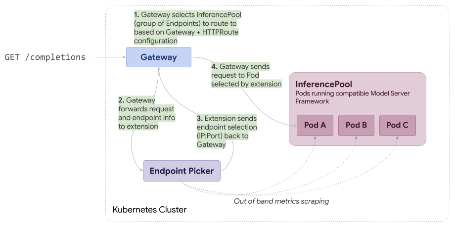
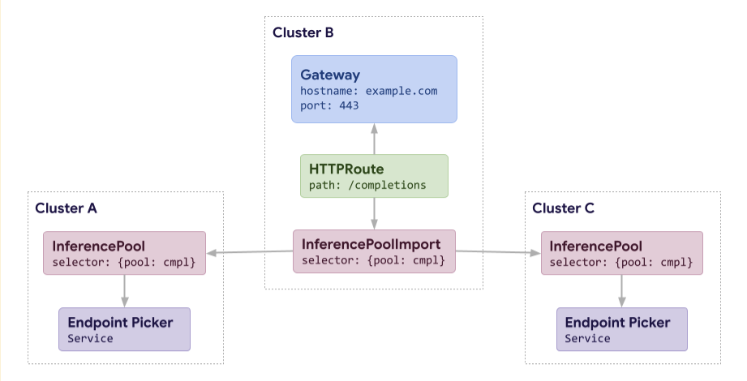
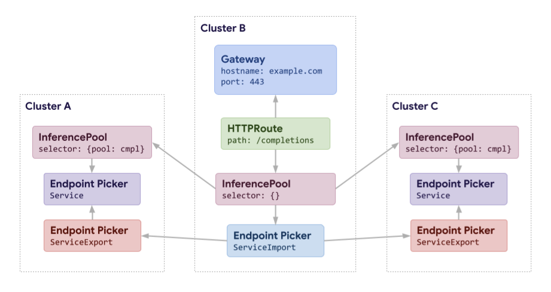

# Multi-Cluster Inference Gateways

Author(s): @robscott, @bexxmodd

## Proposal Status

 ***Draft***

## Summary

Inference Gateways aim to provide efficient routing to LLM workloads running in Kubernetes. In practice, an Inference Gateway is a Gateway that conforms to the [Gateway API Inference Extension](https://gateway-api-inference-extension.sigs.k8s.io/concepts/conformance/). This Gateway supports a new type of backend - InferencePool. When routing to an [InferencePool](https://gateway-api-inference-extension.sigs.k8s.io/api-types/inferencepool/), the Gateway calls out to an “Endpoint Picker” referenced by the InferencePool to get instructions on which specific endpoint within the pool it should route the request to.



### Why Multi-Cluster?

Until now, Inference Gateways have been focused exclusively on routing to a single cluster. Unfortunately, the resources needed to run LLM workloads continue to be scarce, and the desired capacity is rarely available within a single cluster. To address this, we propose expanding InferencePool to support multi-cluster routing.

### Goals

* Enable Inference Gateways to route to backends in multiple clusters.
* Follow a pattern that is familiar to users of [Multi-Cluster Services (MCS)](https://multicluster.sigs.k8s.io/concepts/multicluster-services-api/) and/or Gateways.

### Non-Goals

* Be overly prescriptive about implementation details - this should focus on the resulting UX and leave significant flexibility in how it is achieved.
* L4 ClusterIP routing and/or automatic DNS naming - all traffic needs to flow through the Inference Gateway for this pattern to be useful (otherwise the Endpoint Picker itself would be bypassed).

## Proposal

The multi-cluster Inference Gateway model will largely follow the multi-cluster services model, with a few key differences. We will omit DNS and ClusterIP resolution, and avoid a separate resource, e.g. ServiceExport, by inlining the concept within InferencePool. Additionally, we will add support for having separate Endpoint Pickers in each cluster.



### API Changes

#### InferencePool

A new `inference.networking.k8s.io/export` annotation is added to InferencePool (replacement for ServiceExport resource in MCS). In the future this may become a field, but we’ll start with an annotation to allow for faster iteration. [We’ll avoid using a bool here to align with k8s API conventions](https://github.com/kubernetes/community/blob/master/contributors/devel/sig-architecture/api-conventions.md#primitive-types). The supported values to start will be `Local` and `ClusterSet`. In the future, we may allow for some intermediate values such as Regional or domain-prefixed values.

#### InferencePoolImport

A new API that mirrors ServiceImport from the MCS API. This allows anyone in a connected cluster to reference a Multi-Cluster InferencePool, even if the local cluster does not have a local InferencePool. In the context of Gateway API, that means that a Gateway could be configured to reference an InferencePoolImport, even if that cluster did not contain an InferencePool.
This API will be used almost exclusively for tracking endpoints, but unlike MCS, we actually have two distinct sets of endpoints that we could track:

1. Endpoint Pickers
1. Model Server Endpoints

## Implementation Details

In the happy path, the only type of endpoint that a Gateway would need to know about is Endpoint Pickers. Ultimately, each Gateway will be sending requests to Endpoint Pickers, and then following the directions of that Endpoint Picker. As long as an Endpoint Picker is available, there’s no need to actually propagate the model server endpoints.

### Failure Mode

If the Endpoint Picker is unavailable and the failure mode is configured as “FailOpen”, we could take one of several approaches:

#### Honor FailOpen configuration

This seems to require the Gateway to be aware of at least some model server endpoints, which requires more endpoint propagation.

#### Fail over to other cluster/Endpoint Picker

In a world where there are multiple clusters/Endpoint Pickers to choose from, it may be desirable to fail over to another cluster. Ultimately if all Endpoint Pickers are unavailable, we may end up back at the same problem though of needing to be aware of model server endpoints.

#### Consider FailOpen “Extended” support for multi-cluster

Given the potential complexity of supporting a FailOpen mode for multi-cluster, we could consider this “Extended” or optional support.

### Cluster/Endpoint Picker Selection

It’s likely that each Gateway implementation will have some different logic here, but there will likely be at least two common paths here:

#### Metrics from model server endpoints

In the case where a Gateway is aware of all model server endpoints, it could theoretically also track metrics for each of these endpoints.

#### Metrics from Endpoint Picker

Since Gateways are ultimately deciding which Endpoint Picker to send traffic to, it could make sense for Endpoint Pickers to report back load/utilization data to the Gateway to help inform that decision. (This would reflect the utilization of model server Pods within the local InferencePool managed by each EPP).

#### PreferClose/PreferLocal

Local cluster by default, failover if out of capacity.

### Theoretical Future Enhancement: Multi-Cluster Endpoint Pickers

In the future,  a more advanced implementation could allow Endpoint Pickers to pick from endpoints in other clusters (relying on the same underlying infrastructure that propagates endpoints for this multi-cluster model). We're intentionally avoiding that from the initial scope as it's both more complicated to implement, and unlikely to be scalable given the need for Endpoint Pickers to have a very tight feedback loop (usually via frequent scraping of metrics) with each model server Pod in the InferencePool. Extending that model across clusters could become quite costly.

**Pros**:

* Reuses existing MCS model
* Simplest possible API model
* “Export” configuration lives on InferencePool and clearly applies to the entire pool, not just EPP
* Can clearly reference an InferencePool in other clusters without having one locally

**Cons**:

* Does not reuse MCS API (unclear if this is a con)

## Alternative 1: MCS API for EPP

If we lean into the idea that the only thing a Gateway needs to know is the Endpoint Picker endpoints and what cluster(s) they're associated with, we could build this on top of the MCS API. With this approach, the Endpoint Picker is exposed with a Multi-Cluster Service:



**Pros**:

* Reuses existing MCS infrastructure.
* Likely relatively simple to implement.

**Cons**:

* Referencing InferencePools in other clusters requires you to create an InferencePool locally.
* Significantly more complex configuration (more YAML at least).
* "FailOpen" mode becomes ~impossible if implementations don't actually have some model server endpoints to fall back to.
* In this model, you don’t actually choose to export an InferencePool, you export the Endpoint Picker, that could lead to significant confusion.
* InferencePool is meant to be a replacement for a Service so it may seem counterintuitive for a user to create a Service to achieve multi-cluster inference.

## Alternative 2: New MCS API

One of the key pain points we’re seeing here is that the current iteration of the MCS API requires a tight coupling between name/namespace and kind, with Service being the only kind of backend supported right now. This goes against the broader SIG-Network direction of introducing more focused kinds of backends (like InferencePool). To address this, we could create a resource that has an `exportRef` that allows for exporting different types of resources.

Well we were at it, we could combine the separate `export` and `import` resources that exist today, with `export` acting as the (optional) spec of this new resource, and `import` acting as `status` of the resource. Instead of `import` resources being automatically created, users would create them wherever they wanted to reference or export something to a MultiClusterService.

Here’s a very rough example:

```yaml
apiVersion: networking.k8s.io/v1
kind: MultiClusterService
metadata:
  name: bookinfo
  namespace: bookinfo
spec:
  exportRef:
    group: v1
    kind: Service
    name: bookinfo
    scope: ClusterSet
status:
  conditions:
  - type: Accepted
    status: "True"
    message: "MultiClusterService has been accepted"
    lastTransitionTime: "2025-03-30T01:33:51Z"
  targetCount: 1
  ports:
  - protocol: TCP
    appProtocol: HTTP
    port: 8080
```

### Open Questions

How can we ensure that cross-cluster connections to EPP are secure? (Requires resolution of https://github.com/kubernetes-sigs/gateway-api-inference-extension/issues/735#issuecomment-3133302612)
Can we find a way to configure preferences for where a request should be routed?

### Prior Art

* [GEP-1748: Gateway API Interaction with Multi-Cluster Services](https://gateway-api.sigs.k8s.io/geps/gep-1748/)
* [Envoy Gateway with Multi-Cluster Services](https://gateway.envoyproxy.io/latest/tasks/traffic/multicluster-service/)
* [Multicluster Service API](https://multicluster.sigs.k8s.io/concepts/multicluster-services-api/)
* [Submariner](https://submariner.io/)

### References

* [Original Doc for MultiCluster Inference Gateway](https://docs.google.com/document/d/1QGvG9ToaJ72vlCBdJe--hmrmLtgOV_ptJi9D58QMD2w/edit?tab=t.0#heading=h.q6xiq2fzcaia)