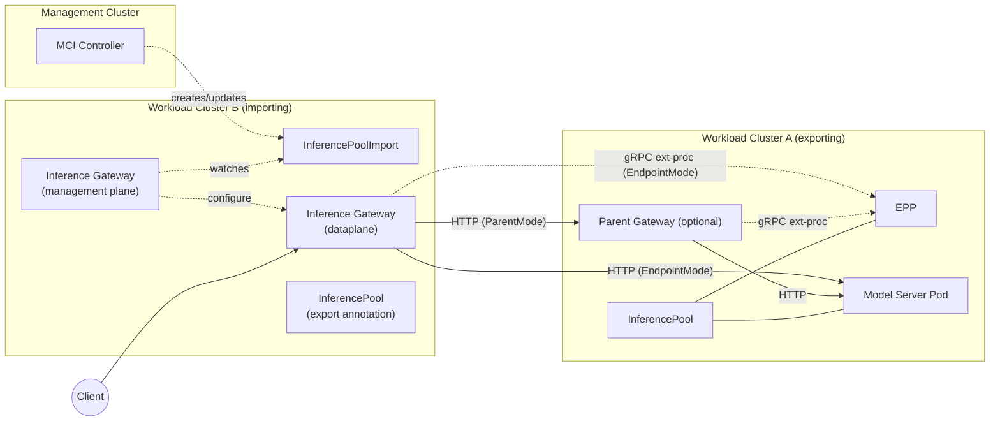

# Multi-Cluster Inference

Author(s): @danehans, @bexxmodd, @robscott

## Proposal Status

 ***Draft***

## Summary

An Inference Gateway (IG) provides efficient routing to LLM workloads in Kubernetes by sending requests to an Endpoint Picker (EPP) associated with an
[InferencePool](https://gateway-api-inference-extension.sigs.k8s.io/api-types/inferencepool/) and routing the request to a backend model server based on
the EPP-provided endpoint. This proposal extends the current model to support multi-cluster routing so capacity in one cluster can serve traffic originating in another.

### Why Multi-Cluster?

GPU capacity is scarce and fragmented. Many users operate multiple clusters across regions and providers. A single cluster rarely satisfies peak or
sustained demand, so a prescribed approach is required to share GPU capacity across clusters by:

- Exporting an InferencePool from a source (“exporting”) cluster.
- Importing the exported InferencePool into one or more destination (“importing”) clusters with enough detail for IGs to route requests to the associated remote model server Pods.

### Goals

- Enable IGs to route to a group of common model server Pods, e.g. InferencePools, that exist in different clusters.
- Align the UX with familiar [Multi-Cluster Services (MCS)](https://multicluster.sigs.k8s.io/concepts/multicluster-services-api/) concepts (export/import).
- Keep the API simple and implementation-agnostic.

### Non-Goals

- Managing DNS or automatic naming.
- Over-specifying implementation details to satisfy a single approach to multi-cluster inference.

## Design Proposal

The Multi-Cluster Inference (MCI) model will largely follow the Multi-Cluster Services (MCS) model, with a few key differences:

- DNS and ClusterIP resolution will be omitted, e.g. ClusterSetIP.
- A separate export resource will be avoided, e.g. ServiceExport, by inlining the concept within InferencePool.

An InferencePoolImport resource is introduced that is meant to be fully managed by an MCI controller. This resource provides the information
required for IGs to route LLM requests to model server endpoints of an InferencePool in remote clusters. How the IG routes the request to the remote cluster
is implementation-specific.

### Workflow

1. **Export an InferencePool:** An [Inference Platform Owner](https://gateway-api-inference-extension.sigs.k8s.io/concepts/roles-and-personas/)
   exports an InferencePool by annotating it.
2. **An MCI Controller (Per [ClusterSet](https://multicluster.sigs.k8s.io/api-types/cluster-set/)):**
   - Watches all ClusterSet member clusters for exported InferencePool resources.
   - CRUDs an InferencePoolImport in each member cluster if:
     - The cluster contains the namespace of the exported InferencePool (namespace sameness).
     - When an InferencePoolImport with the same ns/name already exists in the cluster, update the associated `inferencepoolimport.status.clusters[]` entry.
   - Populates InferencePoolImport status with the information required for importing IGs to route requests to exported InferencePool endpoints,
     e.g. address of the referenced EPP or remote parent
     so the importing IG can either:
     - Connect directly to the remote EPP and then route to the selected endpoint (`EndpointMode`).
     - Route via a remote parent (`ParentMode`).
3. **IG Management Plane (Per Cluster):**
     - Watches InferencePoolImport resources.
     - Programs the managed IG data plane to either:
       - Connect to the exported EPP via gRPC ext-proc for endpoint selection and optionally EPP health/metrics endpoints. Connect directly to exported
         InferencePool endpoints. This mode requires inter-cluster `podCIDR` connectivity (`EndpointMode`).
       - Connect to remote parents, e.g. IGs, of the exported InferencePool. This mode requires inter-cluster parent connectivity (`ParentMode`).
4. **Data Path:**
   The data path is dependant on the export mode selected by the user.
   - `EndpointMode`: Client → local IG → (make scheduling decision) → local/remote EPP → selected model server endpoint → response.
   - `ParentMode`: Client → local IG → (make scheduling decision) → local EPP/remote parent → remote EPP → selected model server endpoint → response.

### InferencePoolImport Naming

The MCI controller will create an InferencePoolImport resource using the exported InferencePool namespace and name. A cluster name entry in `inferencepoolimport.statu.clusters[]` is added for each cluster that exports an InferencePool with the same ns/name.

### InferencePool Selection

InferencePool selection is implementation-specific. The following are examples:

- **Metrics-based:** Scrape EPP-exposed metrics (e.g., ready pods) to bias InferencePool choice.
- **Health-based:** Basic readiness from EPP (gRPC health).
- **Active-Passive:** Select the remote InferencePool when the local EPP fails.

### API Changes

#### Export Annotations

The following annotations are being proposed to indicate the desire to export the InferencePool to clusters of a ClusterSet.

The `inference.networking.x-k8s.io/export` annotation key indicates a desire to export the InferencePool:

```yaml
inference.networking.x-k8s.io/export: "<value>"
```

Supported Values:

- `ClusterSet` – export to all members of the current ClusterSet.

The `inference.networking.x-k8s.io/export-mode` annotation key indicates the routing mode that importing IGs should use for the exported InferencePool:

```yaml
inference.networking.x-k8s.io/export-mode: "<value>"
```

The `inference.networking.x-k8s.io/export-mode` annotation requires the `inference.networking.x-k8s.io/export` annotation to be set.

Supported Values:

- `EndpointMode` – Export InferencePool information required for importing clusters to connect to EPP endpoints.
- `ParentMode` – Export InferencePool information required for importing clusters to connect to EPP endpoints through parent(s) of the InferencePool.

**Note:** Additional annotations, e.g. region/domain scoping, filter clusters in the ClusterSet, etc. and potentially adding an InferencePoolExport resource may be considered in the future.

#### InferencePoolImport

A cluster-local, controller-managed resource that represents an imported InferencePool. It primarily communicates the EPP or parents of the exported InferencePool(s) to the importing IG controller. It is not user-authored; status carries the effective import.
Inference Platform Owners can reference the InferencePoolImport, even if the local cluster does not have an InferencePool. In the context of Gateway API, it means that an HTTPRoute can be configured to reference an InferencePoolImport to route matching requests to remote InferencePool endpoints.
This API will be used almost exclusively for tracking endpoints, but unlike MCS, we actually have two distinct sets of endpoints to track:

1. Endpoint Picker Extensions (EPPs)
2. InferencePool parents, e.g. Gateways

Key ideas:

- Name/namespace sameness with the exported InferencePool (avoids extra indirection).
- Routing mode: whether the IG should connect to remote Endpoints or Parents.
- EPP details: network coordinates and optional health/metrics hints.
- Conditions: Accepted, Ready, etc.

See the full Go type below for additional details.

#### (Optional) InferencePool Status Additions

To reduce controller fan-out, InferencePool status should be updated to surface:

- EPP Service details (type, IPs/hostnames, ports).
- EPP health/metrics port numbers.
- Optional secret references for metrics scraping or inter-cluster mTLS.

(Tracked in Open Questions)

## Controller Responsibilities

**MCI Controller (Per ClusterSet):**

- Discover exported pools.
- For each target cluster, CRUD InferencePoolImport (mirrored namespace/name).
- Populate `status.clusters[]` entries with:
  - EPP service endpoints/ports (and optional health/metrics),
  - Optional remote parents (Gateway Services) if `RoutingModeMode=ParentMode`.

**IG Controller (Per Cluster):**

- Watch InferencePoolImports.
- Program dataplane to either:
  - Connect to to remote EPPs and exported InferencePool endpoints (`EndpointMode`).
  - Connect to exported parent(s) of the exported InferencePool (`ParentMode`).
  - Load-balance matching requests.

## Examples

The following diagram provides a high-level view of the MCI proposal:



### Exporting Cluster (Cluster A) Manifests

In this example, Cluster A exports the InferencePool to all clusters in the Cluster set using `EndpointMode`. This will
cause the MCI controller to create an InferencePoolImport resource in all clusters except the exporting cluster.

```yaml
# Export the pool by annotation
apiVersion: inference.networking.k8s.io/v1
kind: InferencePool
metadata:
  name: llm-pool
  namespace: example
  annotations:
    inference.networking.x-k8s.io/export: "ClusterSet"
    inference.networking.x-k8s.io/export-mode: "EndpointMode"   # or "ParentMode"
spec:
  endpointPickerRef:
    name: epp
    portNumber: 9002
  selector:
    matchLabels:
      app: my-model
  targetPorts:
  - number: 8080
---
# EPP exposed via LoadBalancer for simplicity; ClusterIP also works with podCIDR reachability or via parents
apiVersion: v1
kind: Service
metadata:
  name: epp
  namespace: example
spec:
  selector:
    app: epp
  ports:
  - name: ext-proc
    port: 9002
    targetPort: 9002
    appProtocol: http2
  - name: health
    port: 9003
    targetPort: 9003
  - name: metrics
    port: 9090
    targetPort: 9090
  type: LoadBalancer
```

### Importing Cluster (Cluster B) Manifests

In this example, the InferencePlatform Owner has configured an HTTPRoute to route to endpoints of the Cluster A InferencePool
by referencing the InferencePoolImport as a `backendRef`. The parent IG(s) of the HTTPRoute are responsible for routing to the
endpoints selected by the EPP referenced by the exported InferencePool (surfaced through InferencePoolImport status).

The InferencePoolImport is controller-managed; shown here only to illustrate the expected status shape.

```yaml
apiVersion: inference.networking.x-k8s.io/v1alpha1
kind: InferencePoolImport
metadata:
  name: llm-pool      # mirrors exporting pool name
  namespace: example  # mirrors exporting pool namespace
status:
  clusters:
  - name: cluster-a
    routingMode: EndpointMode # or ParentMode
    targetPortNumber: 8080
    endpointPicker:
     name: epp
     service:
       type: LoadBalancer
       addresses:
       - 1.2.3.4          # EPP service address (IP or hostname)
       ports:
       - number: 9002     # EPP ext-proc port
     health:
       port: 9003
     metrics:
       port: 9090
  conditions:
  - type: Accepted
    status: "True"
  - type: Ready
    status: "True"
---
# Route in the importing cluster that targets the imported pool
apiVersion: gateway.networking.k8s.io/v1beta1
kind: HTTPRoute
metadata:
  name: llm-route
  namespace: example
spec:
  parentRefs:
  - name: inf-gw
  hostnames:
  - my.model.com
  rules:
  - matches:
    - path:
        type: PathPrefix
        value: /completions
    backendRefs:
    - group: inference.networking.x-k8s.io
      kind: InferencePoolImport
      name: llm-pool-cluster-a
```

An implementation MUST conform to Gateway API specifications, including when the HTTPRoute contains InferencePool and InferencePoolImport `backendRefs`,
e.g. `weight`-based load balancing. In the following example, traffic MUST be split equally between Cluster A and B InferencePool endpoints when
using the following `backendRefs`:

```yaml
    backendRefs:
    - group: inference.networking.k8s.io
      kind: InferencePool
      name: llm-pool
      weight: 50
    - group: inference.networking.x-k8s.io
      kind: InferencePoolImport
      name: llm-pool
      weight: 50
```

### Go Types

```go
package v1alpha1

import (
    corev1 "k8s.io/api/core/v1"
    metav1 "k8s.io/apimachinery/pkg/apis/meta/v1"
)

// +kubebuilder:object:root=true
// +kubebuilder:resource:scope=Namespaced,shortName=ipimp
// +kubebuilder:subresource:status
//
// InferencePoolImport represents an imported InferencePool from another cluster.
// This resource is controller-managed; users typically do not author it directly.
type InferencePoolImport struct {
    metav1.TypeMeta   `json:",inline"`
    metav1.ObjectMeta `json:"metadata,omitempty"`

    // Spec is intentionally empty since this resource is fully managed by controllers.
    // Future versions may surface user-tunable knobs here (e.g., local policy hints).
    Spec InferencePoolImportSpec `json:"spec,omitempty"`

    // Status communicates the imported targets (EPPs and/or parents) and readiness.
    Status InferencePoolImportStatus `json:"status,omitempty"`
}

type InferencePoolImportSpec struct{}

// RoutingMode expresses how the importing IG should route requests to the exported pool.
type RoutingMode string

const (
    // EndpointMode means the IG should route to remote model server endpoints directly (podCIDR/routed).
    RoutingModeEndpoint RoutingMode = "EndpointMode"
    // ParentMode means the IG should route via a remote "parent" (e.g., Gateway Service) that fronts the pool.
    RoutingModeParent RoutingMode = "ParentMode"
)

type InferencePoolImportStatus struct {
    // Clusters is the set of exporting clusters that currently back this import.
    //
    // +kubebuilder:validation:Required
    Clusters []ImportedCluster `json:"clusters"`

    // Conditions include:
    // - Accepted: controller synthesized a valid import.
    // - Ready: at least one EPP/parent is ready.
    //
    // +kubebuilder:validation:Optional
    Conditions []metav1.Condition `json:"conditions,omitempty"`

    // ObservedGeneration reflects the generation observed by the controller.
    //
    // +kubebuilder:validation:Optional
    ObservedGeneration int64 `json:"observedGeneration,omitempty"`
}

type ImportedCluster struct {
    // Name of the exporting cluster (must be unique within the list).
    //
    // +kubebuilder:validation:Required
    Name string `json:"name"`

    // RoutingMode provides a hint to InferenceGateways how to program data plane
    // for this import.
    //
    // +kubebuilder:validation:Enum=EndpointMode;ParentMode
    // +kubebuilder:validation:Required
    RoutingMode RoutingMode `json:"routingMode"`

    // TargetPortNumber is the port the model servers listen on in the exported pool.
    // Used when RoutingMode=EndpointMode.
    //
    // +kubebuilder:validation:Required
    TargetPortNumber int32 `json:"targetPortNumber"`

    // EndpointPicker describes how to connect to the EPP in the exporting cluster.
    // Used when RoutingMode=EndpointMode.
    //
    // +kubebuilder:validation:Optional
    EndpointPicker EndpointPickerImport `json:"endpointPicker,omitempty"`

    // Parents describes optional "parent" frontends (e.g., Gateways) to route through
    // when RoutingMode=ParentMode.
    //
    // +kubebuilder:validation:Optional
    Parents []ParentImport `json:"parents,omitempty"`

    // Conditions for cluster-scoped readiness (e.g., per-cluster EPP health).
    Conditions []metav1.Condition `json:"conditions,omitempty"`
}

type EndpointPickerImport struct {
    // Name of the EPP (informational).
    //
    // +kubebuilder:validation:Required
    Name string `json:"name"`

    // Service endpoints (addresses + ports) where the EPP exposes ext-proc.
    //
    // +kubebuilder:validation:Required
    Service []ServiceImport `json:"service"`

    // Health endpoint (optional) of the exported EPP.
    //
    // +kubebuilder:validation:Optional
    Health *HealthEndpoint `json:"health,omitempty"`

    // Metrics endpoint (optional) of the exported EPP.
    //
    // +kubebuilder:validation:Optional
    Metrics *MetricsEndpoint `json:"metrics,omitempty"`
}

// ParentImport models a remote "parent" (typically a Gateway Service) that fronts
// the imported InferencePool.
type ParentImport struct {
    Name       string `json:"name"`
    Namespace  string `json:"namespace"`
    Service    []ServiceImport `json:"service"`
    Conditions []metav1.Condition `json:"conditions,omitempty"`
}

type ServiceImport struct {
    // Type mirrors core Service types for clarity.
    // +kubebuilder:validation:Enum=ClusterIP;NodePort;LoadBalancer;ExternalName
    //
    // +kubebuilder:validation:Required
    Type corev1.ServiceType `json:"type"`

    // Addresses supports IPs and/or hostnames of the remote service.
    //
    // +kubebuilder:validation:Optional
    Addresses []string `json:"addresses,omitempty"`

    // Ports exposed by the remote service (e.g., 9002 for EPP ext-proc).
    //
    // +kubebuilder:validation:Optional
    Ports []Port `json:"ports,omitempty"`
}

type HealthEndpoint struct {
    Port int32  `json:"port"`
    // Optional: reference to a secret containing credentials for secure health checks.
    SecretRef *corev1.SecretReference `json:"secretRef,omitempty"`
}

type MetricsEndpoint struct {
    Port int32 `json:"port"`
    // Optional: reference to a secret containing scrape credentials.
    SecretRef *corev1.SecretReference `json:"secretRef,omitempty"`
}

// +kubebuilder:object:root=true
type InferencePoolImportList struct {
    metav1.TypeMeta `json:",inline"`
    metav1.ListMeta `json:"metadata,omitempty"`
    Items           []InferencePoolImport `json:"items"`
}
```

### Failure Mode

EPP failure modes continue to work as-is.

#### EPP Selection

Since an IG decides which EPP to use for endpoint selection when multiple InferencePool/InferencePoolImport `backendRefs` exist,
an implementation MAY use EPP metrics and/or health data to make a load-balancing decision.

## Alternatives

### Option 1: Reuse MCS API for EPP

Reuse MCS to export EPP Services. This approach provides simple infra, but may be confusing to users (you “export EPPs” not pools) and
requires a separate MCS parent export for parent-based inter-cluster routing.

**Pros**:

- Reuses existing MCS infrastructure.
- Relatively simple to implement.

**Cons**:

- Referencing InferencePools in other clusters requires you to create an InferencePool locally.
- In this model, you don’t actually choose to export an InferencePool, you export the EPP or InferencePool parent(s) service, that could lead to significant confusion.
- InferencePool is meant to be a replacement for a Service so it may seem counterintuitive for a user to create a Service to achieve multi-cluster inference.

## Option 2: New MCS API

One of the key pain points we’re seeing here is that the current iteration of the MCS API requires a tight coupling between name/namespace and kind, with Service being the only kind of backend supported right now. This goes against the broader SIG-Network direction of introducing more focused kinds of backends (like InferencePool). To address this, we could create a resource that has an `exportRef` that allows for exporting different types of resources.

While we were at it, we could combine the separate `export` and `import` resources that exist today, with `export` acting as the (optional) spec of this new resource, and `import` acting as `status` of the resource. Instead of `import` resources being automatically created, users would create them wherever they wanted to reference or export something to a MultiClusterService.

Here’s a very rough example:

```yaml
apiVersion: networking.k8s.io/v1
kind: MultiClusterService
metadata:
  name: epp
  namespace: example
spec:
  exportRef:
    group: v1
    kind: Service
    name: epp
    scope: ClusterSet
status:
  conditions:
  - type: Accepted
    status: "True"
    message: "MultiClusterService has been accepted"
    lastTransitionTime: "2025-03-30T01:33:51Z"
  targetCount: 1
  ports:
  - protocol: TCP
    appProtocol: HTTP
    port: 8080
```

### Open Questions

#### Export Semantics

- Finalize annotation key/values and ClusterSet discovery. Should we introduce an annotation to filter exporting to specific clusters in the ClusterSet?
- Should we allow per-cluster export configuration (weights, region, SLO tags) at export time?

#### InferencePool status surface

- Do we extend InferencePool status to publish EPP Service type/addresses/ports, health, metrics, and optional secret refs to simplify imports?
- Should EPP Deployment/Pod discovery be standardized (labels/port names) for health/metrics auto-discovery?

#### Security

- Provide a standard way to bootstrap mTLS between importing IG and exported EPP/parents, e.g. use BackendTLSPolicy?
- Should the MCI controller mirror secrets into the importing cluster (and how to scope/rotate them)?
- Do we need a ReferenceGrant-like mechanism for cross-namespace secrets referenced by InferencePoolImport?

#### Scheduling and Policy

- Do we define a common `RoutingMode` enum (`EndpointMode` vs `ParentMode`) as above? Is a mixed strategy allowed per InferencePoolImport?
- Should we define a standard cluster preference knob (e.g., PreferLocal, Any, region-affinity, weights) on InferencePoolImport status or IG-local policy CRD?

#### Topology and Reachability

- For `ParentMode`, do we require “HTTPRoute sameness” or any guarantees between exporting/importing clusters?

#### EPP Scale

- If the EPP has multiple replicas, should the MCI controller publish per-replica addresses, e.g. service subsetting, for health/metrics scraping?

#### Observability

- Refine InferencePool status conditions (e.g., EPPReady, ParentsReady, ResolvedRefs)?
- Should we reconsider using an export resource instead of an InferencePool annotation for UX purposes- specifically surfacing status conditions such as
  not being able to export an InferencePool b/c the namespace of the exported InferencePool does not exist in importing clusters.

#### Ownership and Lifecycle

- Should the MCI controller be owned by the Gateway API Inference Extension project?
- What happens if the importing namespace doesn’t exist? Should the MCI controller skip or optionally create it? Introducing an InferencePoolExport resource instead of annotations could help resolve this issue.
- Garbage collection when export is withdrawn (delete import?) and how to drain traffic safely.

### Prior Art

- [GEP-1748: Gateway API Interaction with Multi-Cluster Services](https://gateway-api.sigs.k8s.io/geps/gep-1748/)
- [Envoy Gateway with Multi-Cluster Services](https://gateway.envoyproxy.io/latest/tasks/traffic/multicluster-service/)
- [Multi-Cluster Service API](https://multicluster.sigs.k8s.io/concepts/multicluster-services-api/)

### References

- [Initial Multi-Cluster Inference Design Doc](https://docs.google.com/document/d/1QGvG9ToaJ72vlCBdJe--hmrmLtgOV_ptJi9D58QMD2w/edit?tab=t.0#heading=h.q6xiq2fzcaia)

### Notes for reviewers

- The InferencePoolImport CRD is intentionally status-only to keep the UX simple and controller-driven.
- The InferencePool namespace sameness simplifies identity and lets HTTPRoute authors reference imports without new indirection.
