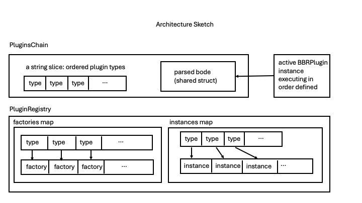

# Pluggable Body-Based Routing (BBR) Framework 

Author(s): @davidbreitgand @srampal

## Proposal Status

***Draft***

## Summary

The Gateway API Inference Extension (v1.2.1) includes an initial implementation of Body-Based Routing (BBR). Currently, BBR provides a single capability: it extracts the model name from the request body and adds it to the `X-Gateway-Model-Name` header. This header is then used to route the request to the appropriate InferencePool and its associated Endpoint Picker Extension (EPP) instances.

The current BBR implementation is limited and lacks extensibility. Similar to the [pluggability introduced in the scheduling subsystem](../0845-scheduler-architecture-proposal/README.md), BBR should support custom extensions without requiring modifications to the GIE code base.

This proposal introduces a plugin architecture for BBR that allows developers to implement custom logic. Plugins could be organized into a chain or DAG for ordered and concurrent execution.

See [this document](https://docs.google.com/document/d/1So9uRjZrLUHf7Rjv13xy_ip3_5HSI1cn1stS3EsXLWg/edit?tab=t.0#heading=h.55jwocr94axs) for additional context amd reference.

## Goals

The pluggable BBR Framework aims at addressing the following goals

- Avoid monolithic architecture
- Mimic pluggability and configurability of the scheduling subsystem without coupling between the two
- Enable organizing plugins into a topology for ordered and concurrent execution
- Avoid redundant recurrent body parsing across plugins in a topology for the sake of performance
- Limit changes to the BBR feature to avoid any changes in the rest of the code base
- Follow best practices and experience from the Scheduling subsystem
  pluggability effort. For example, extending the system to support the above
  should be through implementing well defined `Plugin` interfaces and registering
  them in the BBR subsystem; any configuration would be done in the
  same way (e.g., code and/or configuration file)
- Reuse common code from EPP, such as `TypedName`, wherever make sense, but avoid reusing specialized code with non-BBR functionality to avoid abuse
- Enable extensible collection and registration of metrics using lessons from the pluggable scheduling sub-system
- Provide reference plugin implementations.

## Non-Goals

- Modify existing GIE abstractions
- Fully align plugins, registries, and factories across BBR and EPP
- Dynamically reconfigure plugins and plugin topologies at runtime

## Proposal

### Overview

There is an embedded `BBRPlugin` interface building on the `Plugin` interface adopted from EPP. This interface should be implemented by any BBR plugin. Each pluigin is identified by its `TypedName` (adopted from EPP), where `TypedName().Type` gives the string representing the type of the plugin and `TypedName().Name()` returns the string representing the plugins implementation. BBR is refactored to implement the registered factory pattern. To that end, a `PluginRegistry` interface and its implementation are added to register `BBRPlugin` factories and concrete implementations created by the factories.
In addition, a `PluginsChain` interface is defined to define an order of plugin executions. In the future, `PluginsChain` will be replaced by `PluginsDAG` to allow for more complex topological order and concurrency.

`PluginsChain` only contains ordered `BBRPlugin` types registered in the `PluginRegistry`. `RequestPluginsChain` and `ResponsePluginsChain` are optionally configured for handling requests and responses respectively. If no configuration is provided, default `PluginsChain` instances will be configured automatically.

Depending on a `BBRPlugin` functionality and implementation, the plugin might require full or selective body parsing. To save the parsing overhead, if there is at least one `BBRPlugin` in the `PluginsChain` that requires full body parsing, the parsing is performed only once into a shared official appropriate `openai-go` struct (either `openai.CompletionNewParams`  or `openai.ChatCompletionNewParams` depending on the request endpoint). This struct is shared for read-only to all plugins in the chain. Each `BBRplugin` receives the shared struct by value. If a plugin needs to mutate the body, in the initial implementation, it MUST work on its own copy, and the a mutated body is returned separately by each plugiin.

### Suggested Components

The sketch of the proposed framework is shown in the figure below.


### Suggested BBR Pluggable Framework Interfaces

```go
// ------------------------------------ Defaults ------------------------------------------
const DefaultPluginType = "MetadataExtractor"
const DefaultPluginImplementation = "simple-model-selector"

// BBRPlugin defines the interface for plugins in the BBR framework 
type BBRPlugin interface {
    plugins.Plugin

    // RequiresFullParsing indicates whether full body parsing is required
    // to facilitate efficient memory sharing across plugins in a chain.
    RequiresFullParsing() bool

    // Execute runs the plugin logic on the request body.
    // A plugin's imnplementation logic CAN mutate the body of the message.
    // A plugin's implementation MUST return a map of headers
    // If no headers are set by the implementation, the map must be empty
    // A value of a header in an extended implementation NEED NOT to be identical to the value of that same header as would be set
    // in a default implementation.
    // Example: in the body of a request model is set to "semantic-model-selector",
    // which, say, stands for "select a best model for this request at minimal cost"
    // A plugin implementation of "semantic-model-selector" sets X-Gateway-Model-Name to any valid
    // model name from the inventory of the backend models and also mutates the body accordingly
    // In contrast,
    Execute(requestBodyBytes []byte) (
        headers map[string]string,
        mutatedBodyBytes []byte,
        err error,
    )
}


// placeholder for BBRPlugin constructors
type PluginFactoryFunc func() bbrplugins.BBRPlugin //concrete constructors are assigned to this type

// PluginRegistry defines operations for managing plugin factories and plugin instances
type PluginRegistry interface {
    RegisterFactory(typeKey string, factory PluginFactoryFunc) error //constructors
    RegisterPlugin(plugin bbrplugins.BBRPlugin) error //registers a plugin instance (the instance MUST be created via the factory first)
    GetFactory(typeKey string) (PluginFactoryFunc, error)
    GetPlugin(typeKey string) (bbrplugins.BBRPlugin, error)
    GetFactories() map[string]PluginFactoryFunc
    GetPlugins() map[string]bbrplugins.BBRPlugin
    ListPlugins() []string
    ListFactories() []string
    CreatePlugin(typeKey string) (bbrplugins.BBRPlugin, error)
    ContainsFactory(typeKey string) bool
    ContainsPlugin(typeKey string) bool
    String() string    //human readable string for logging
}

// PluginsChain is used to define a specific order of execution of the BBRPlugin instances stored in the registry
// The BBRPlugin instances 
type PluginsChain interface {
    AddPlugin(typeKey string, registry PluginRegistry) error                    //to be added to the chain the plugin should be registered in the registry first
    AddPluginAtInd(typeKey string, i int, r PluginRegistry) error               //only affects the instance of the plugin chain
    GetPlugin(index int, registry PluginRegistry) (bbrplugins.BBRPlugin, error) //retrieves i-th plugin as defined in the chain from the registry
    Length() int
    ParseChatCompletion(data []byte) (openai.ChatCompletionNewParams, error)    //parses the bytes slice into an appropriate openai-go struct
    ParseCompletion(data []byte) (openai.CompletionNewParams, error)            //likewise
    GetSharedMemory(which string) interface{}  //returns an appropriate shared open-ai struct dependent on whether which 
                                               //corresponds to Completion or ChatCompletion endpoint requested in the body 
    Run(bodyBytes []byte, registry PluginRegistry) ([]byte, map[string]string, error) //return potentially mutated body and all headers map safely merged
    String() string
}
//NOTE: for simplicity, in the initial PR, PluginsChain instance will be defined request only 
```

### Defaults

```go

const (
    //A deafult plugin implementation of this plugin type will always be configured for request plugins chain
    //Even though BBRPlugin type is not (yet) a K8s resource, it's logically akin to `kind`
    //MUST start wit an upper case letter, use CamelNotation, only aplhanumericals after the first letter
    PluginTypePattern   = `^[A-Z][A-Za-z0-9]*$`
    MaxPluginTypeLength = 63
    DefaultPluginType   = "MetaDataExtractor"
    // Even though BBRPlugin is not a K8s resource yet, let's make its naming compliant with K8s resource naming
    // Allows: lowercase letters, digits, hyphens, dots.
    // Must start and end with a lowercase alphanumeric character.
    // Middle characters group can contain lowercase alphanumerics, hyphens, and dots
    // Middle and rightmost groups are optional
    PluginNamePattern   = `^[a-z0-9]([-a-z0-9.]*[a-z0-9])?$`
    DefaultPluginName   = "simple-model-extractor"
    MaxPluginNameLength = 253
    //Well-known custom header set to a model name
    ModelHeader = "X-Gateway-Model-Name"
)
```

### Current BBR reimplementation as BBRPlugin

```go
/ ------------------------------------ DEFAULT PLUGIN IMPLEMENTATION ----------------------------------------------

type simpleModelExtractor struct { //implements the MetadataExtractor interface
    typedName           plugins.TypedName
    requiresFullParsing bool
}

// defaultMetaDataExtractor implements the MetadataExtractor interface and extracts only the mmodel name AS-IS
type defaultMetaDataExtractor struct {
    typedName           plugins.TypedName
    requiresFullParsing bool //this field will be used to determine whether shared struct should be created in this chain
}

// NewSimpleModelExtractor is a factory that constructs SimpleModelExtractor plugin
// A developer who wishes to create her own implementation, will implement the BBRPlugin interface and
// use Registry and PluginsChain to register and execute the plugin (together with other plugins in a chain)
func NewDefaultMetaDataExtractor() BBRPlugin {
    return &defaultMetaDataExtractor{
        typedName: plugins.TypedName{
            Type: DefaultPluginType,
            Name: "simple-model-extractor",
        },
        requiresFullParsing: false,
    }
}

func (s *defaultMetaDataExtractor) RequiresFullParsing() bool {
    return s.requiresFullParsing
}

func (s *defaultMetaDataExtractor) TypedName() plugins.TypedName {
    return s.typedName
}

// Execute extracts the "model" from the JSON request body and sets X-Gateway-Model-Name header.
// This implementation intentionally ignores metaDataKeys and does not mutate the body.
// It expects the request body to be a JSON object containing a "model" field.
// A nil for metaDataKeysToHeaders map SHOULD be specified by a caller for clarity
// The metaDataKeysToHeaders is explicitly ignored in this implementation
// This implementation is simply refactoring of the default BBR implementation to work with the pluggable framework
func (s *defaultMetaDataExtractor) Execute(requestBodyBytes []byte) (
    headers map[string]string,
    mutatedBodyBytes []byte,
    err error) {

    type RequestBody struct {
        Model string `json:"model"`
    }

    h := make(map[string]string)

    var requestBody RequestBody

    if err := json.Unmarshal(requestBodyBytes, &requestBody); err != nil {
        // return original body on decode failure
        return nil, requestBodyBytes, err
    }

    if requestBody.Model == "" {
       return nil, requestBodyBytes, fmt.Errorf("missing required field: model")
    }

    // ModelHeader is a constant defined in ./pkg/bbr/plugins/interfaces
    h[ModelHeader] = requestBody.Model

    // Body is not mutated in this implementation hence returning original requestBodyBytes. This is intentional.
    return h, requestBodyBytes, nil
}

func (s *defaultMetaDataExtractor) String() string {
    return fmt.Sprintf(("BBRPlugin{%v/requiresFullParsing=%v}"), s.TypedName(), s.requiresFullParsing)
}
```

### Implementation Phases

The pluggable framework will be implemented iteratively over several phases.

1. Introduce `BBRPlugin` `MetadataExtractor`, interface, registry, plugins chain, sample plugin implementation (`SimpleModelExtraction`) and its factory. Plugin configuration will be implemented via environment variables set in helm chart
1. Introduce a second plugin interface, `ModelSelector` and sample plugin implementation
1. Introduce shared struct (shared among the plugins of a plugins chain)
1. Introduce an interface for guardrail plugin, introduce simple reference implementation, experiment with plugins chains on request and response messages
1. Refactor metrics as needed to work with the new pluggable framework
1. Implement configuration via manifests similar to those in EPP
1. Implement `PluginsDAG` to allow for more complex topological order and concurrency.
1. Continously learn lessons from this implementation and scheduling framework to improve the implementation
1. Aim at aligning and cross-polination with the [AI GW WG]("https://github.com/kubernetes-sigs/wg-ai-gateway").

## Open Questions

1. More elaborate shared memory architecture for the best performance
1. TBA

## Note

The proposed interfaces can slightly change from those implemented in the initial [PR 1981](https://github.com/kubernetes-sigs/gateway-api-inference-extension/pull/1981)