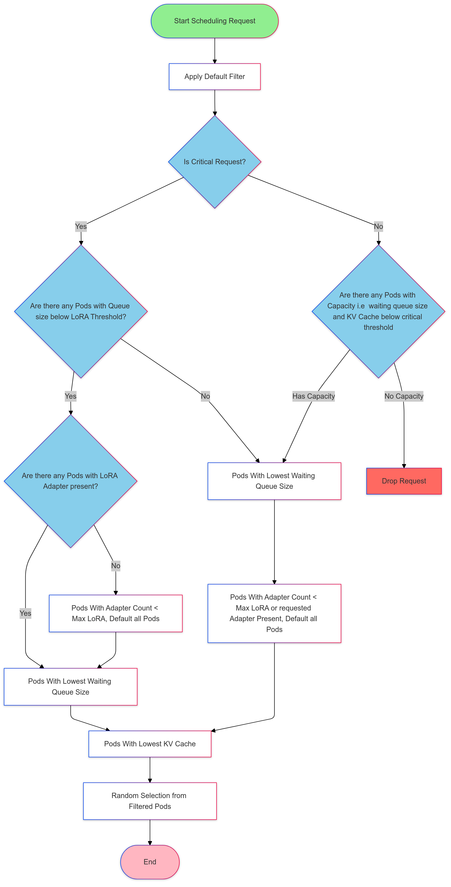

## Quickstart

### Requirements
The current manifests rely on Envoy Gateway [v1.2.1](https://gateway.envoyproxy.io/docs/install/install-yaml/#install-with-yaml) or higher.

### Steps

1. **Deploy Sample vLLM Application**

   Create a Hugging Face secret to download the model [meta-llama/Llama-2-7b-hf](https://huggingface.co/meta-llama/Llama-2-7b-hf). Ensure that the token grants access to this model. 
   Deploy a sample vLLM deployment with the proper protocol to work with the LLM Instance Gateway.
   ```bash
   kubectl create secret generic hf-token --from-literal=token=$HF_TOKEN # Your Hugging Face Token with access to Llama2
   kubectl apply -f ./manifests/vllm/vllm-lora-deployment.yaml
   ```

1. **Install the CRDs into the cluster:**

   ```sh
   make install
   ```

1. **Deploy InferenceModel and InferencePool**

   Deploy a sample InferenceModel and InferencePool configuration based on the vLLM deployments mentioned above.
   ```bash
   kubectl apply -f ./manifests/inferencepool-with-model.yaml
   ```

1. **Update Envoy Gateway Config to enable Patch Policy**

   Our custom LLM Gateway ext-proc is patched into the existing envoy gateway via `EnvoyPatchPolicy`. To enable this feature, we must extend the Envoy Gateway config map. To do this, simply run:
   ```bash
   kubectl apply -f ./manifests/gateway/enable_patch_policy.yaml
   kubectl rollout restart deployment envoy-gateway -n envoy-gateway-system
   ```
   Additionally, if you would like to enable the admin interface, you can uncomment the admin lines and run this again.

1. **Deploy Gateway**

   ```bash
   kubectl apply -f ./manifests/gateway/gateway.yaml
   ```
   > **_NOTE:_** This file couples together the gateway infra and the HTTPRoute infra for a convenient, quick startup. Should you wish to experiment on the same gateway, a new `Backend` & `HTTPRoute` will need to be created per route/pool you would like.

1. **Deploy Ext-Proc**

   ```bash
   kubectl apply -f ./manifests/ext_proc.yaml
   ```

1. **Deploy Envoy Gateway Custom Policies**

   ```bash
   kubectl apply -f ./manifests/extension_policy.yaml
   kubectl apply -f ./manifests/patch_policy.yaml
   ```
   > **_NOTE:_** This is also per InferencePool, and will need to be configured to support the new pool should you wish to experiment further

1. **OPTIONALLY**: Apply Traffic Policy

   For high-traffic benchmarking you can apply this manifest to avoid any defaults that can cause timeouts/errors.

1. **Try it out**

   Wait until the gateway is ready.

   ```bash
   IP=$(kubectl get gateway/inference-gateway -o jsonpath='{.status.addresses[0].value}')
   PORT=8081

   curl -i ${IP}:${PORT}/v1/completions -H 'Content-Type: application/json' -d '{
   "model": "tweet-summary",
   "prompt": "Write as if you were a critic: San Francisco",
   "max_tokens": 100,
   "temperature": 0
   }'
   ```

## Scheduling Package in Ext Proc
The scheduling package implements request scheduling algorithms for load balancing requests across backend pods in an inference gateway. The scheduler ensures efficient resource utilization while maintaining low latency and prioritizing critical requests. It applies a series of filters based on metrics and heuristics to select the best pod for a given request.

# Flowchart
