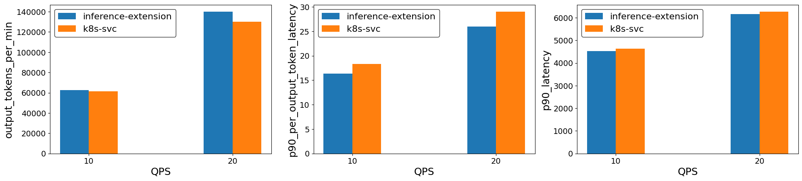

# Benchmark

This user guide shows how to run benchmarks against a vLLM model server deployment by using both Gateway API
Inference Extension, and a Kubernetes service as the load balancing strategy. The benchmark uses the
[Latency Profile Generator](https://github.com/AI-Hypercomputer/inference-benchmark) (LPG) tool to generate
load and collect results.

## Prerequisites

### Deploy the inference extension and sample model server

Follow the [getting started guide](https://gateway-api-inference-extension.sigs.k8s.io/guides/#getting-started-with-gateway-api-inference-extension)
to deploy the vLLM model server, CRDs, etc.

__Note:__ Only the GPU-based model server deployment option is supported for benchmark testing.

### [Optional] Scale the sample vLLM deployment

You are more likely to see the benefits of the inference extension when there are a decent number of replicas to make the optimal routing decision.

```bash
kubectl scale deployment vllm-llama3-8b-instruct --replicas=8
```

### Expose the model server via a k8s service

To establish a baseline, expose the vLLM deployment as a k8s service:

```bash
kubectl expose deployment vllm-llama3-8b-instruct --port=80 --target-port=8000 --type=LoadBalancer
```

## Run benchmark

The LPG benchmark tool works by sending traffic to the specified target IP and port, and collecting the results.
Follow the steps below to run a single benchmark. Multiple LPG instances can be deployed to run benchmarks in
parallel against different targets.

1. Install the LPG benchmark tool by running the below helm chart.
    ```bash
    export BENCHMARK_DEPLOYMENT_NAME=benchmark-tool
    helm install $BENCHMARK_DEPLOYMENT_NAME \
    --set moderlServingEndpoint.mode=service \
    --set moderlServingEndpoint.name=vllm-llama3-8b-instruct\
    --set moderlServingEndpoint.namespace=default \
    oci://registry.k8s.io/gateway-api-inference-extension/charts/benchmark
    ```

## Download the results
1. Check out the repo to use the tools available to download and analyse the benchmark results

    ```bash
    git clone https://github.com/kubernetes-sigs/gateway-api-inference-extension
    cd gateway-api-inference-extension
    ```

1. When the LPG tool finishes benchmarking, it will print a log line `LPG_FINISHED`. The script below will watch for that log line and then start downloading results. Use the `benchmark_id` environment variable to specify what this benchmark is for. For instance, `inference-extension` or `k8s-svc`. Use `BENCHMARK_DEPLOYMENT_NAME` environment variable to specify the deployment name used in previous step to install the LPG benchmark helm chart to download the results from respective deployment.

    ```bash
    benchmark_id='k8s-svc' BENCHMARK_DEPLOYMENT_NAME=benchmark-tool ./tools/benchmark/download-benchmark-results.bash
    ```

    After the script finishes, you should see benchmark results under `./tools/benchmark/output/default-run/k8s-svc/results/json` folder.
    Here is a [sample json file](./sample.json). Replace `k8s-svc` with `inference-extension` when running an inference extension benchmark.

### Tips

* When using a `benchmark_id` other than `k8s-svc` or `inference-extension`, the labels in `./tools/benchmark/benchmark.ipynb` must be
  updated accordingly to analyze the results.
* You can specify `run_id="runX"` environment variable when running the `./download-benchmark-results.bash` script.
This is useful when you run benchmarks multiple times to get a more statistically meaningful results and group the results accordingly.
* Update the `request_rates` that best suit your benchmark environment.

### Advanced Benchmark Configurations

Refer to the [LPG user guide](https://github.com/AI-Hypercomputer/inference-benchmark?tab=readme-ov-file#configuring-the-benchmark) for a
detailed list of configuration knobs.

## Analyze the results

This guide shows how to run the jupyter notebook using vscode after completing k8s service and inference extension benchmarks.

1. Create a python virtual environment.

    ```bash
    python3 -m venv .venv
    source .venv/bin/activate
    ```

1. Install the dependencies.

    ```bash
    pip install -r ./tools/benchmark/requirements.txt
    ```

1. Open the notebook `./tools/benchmark/benchmark.ipynb`, and run each cell. In the last cell update the benchmark ids with`inference-extension` and `k8s-svc`. At the end you should
    see a bar chart like below where **"ie"** represents inference extension. This chart is generated using this benchmarking tool with 6 vLLM (v1) model servers (H100 80 GB), [llama2-7b](https://huggingface.co/meta-llama/Llama-2-7b-chat-hf/tree/main) and the [ShareGPT dataset](https://huggingface.co/datasets/anon8231489123/ShareGPT_Vicuna_unfiltered/resolve/main/ShareGPT_V3_unfiltered_cleaned_split.json).
    
    