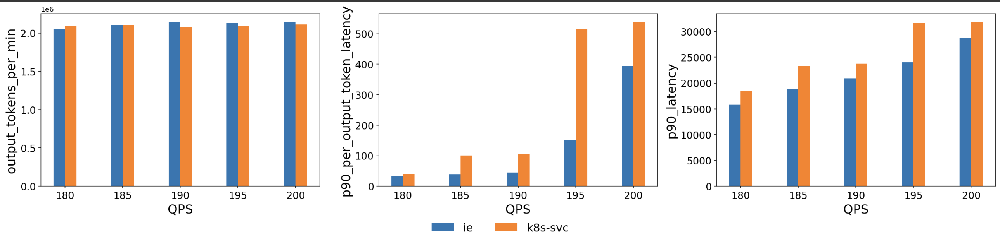

# Benchmark

This user guide shows how to run benchmarks against a vLLM deployment, by using both the Gateway API
inference extension, and a Kubernetes service as the load balancing strategy. The
benchmark uses the [Latency Profile Generator](https://github.com/AI-Hypercomputer/inference-benchmark) (LPG)
tool to generate load and collect results.

## Run benchmarks manually

### Prerequisite: have an endpoint ready to server inference traffic

To serve via a Gateway using the inference extension, follow this [user guide](https://gateway-api-inference-extension.sigs.k8s.io/guides/)
to deploy the sample vLLM application, and the inference extension.

You will more likely to see the benefits of the inference extension when there are a decent number of replicas to make the optimal routing decision. So consider scaling the sample application with more replicas:

```bash
kubectl scale --replicas=8 -f https://github.com/kubernetes-sigs/gateway-api-inference-extension/raw/main/config/manifests/vllm/gpu-deployment.yaml
```

To serve via a Kubernetes LoadBalancer service as a baseline comparison, you can expose the sample application:

```bash
kubectl expose -f https://github.com/kubernetes-sigs/gateway-api-inference-extension/raw/main/config/manifests/vllm/gpu-deployment.yaml --port=8081 --target-port=8000 --type=LoadBalancer
```

### Run benchmark

The LPG benchmark tool works by sending traffic to the specified target IP and port, and collect results. Follow the steps below to run a single benchmark. You can deploy multiple LPG instances if you want to run benchmarks in parallel against different targets.

1. Check out the repo.
    
    ```bash
    git clone https://github.com/kubernetes-sigs/gateway-api-inference-extension
    cd gateway-api-inference-extension
    ```

1. Get the target IP. Examples below show how to get the IP of a gateway or a LoadBalancer k8s service.

    ```bash
    # Get gateway IP
    GW_IP=$(kubectl get gateway/inference-gateway -o jsonpath='{.status.addresses[0].value}')
    # Get LoadBalancer k8s service IP
    SVC_IP=$(kubectl get gateway/inference-gateway -o jsonpath='{.status.addresses[0].value}')

    echo $GW_IP
    echo $SVC_IP
    ```

1. Then update the `<target-ip>` in `./config/manifests/benchmark/benchmark.yaml` to your target IP. Feel free to adjust other parameters such as request_rates as well. For a complete list of LPG configurations, pls refer to the [LPG user guide](https://github.com/AI-Hypercomputer/inference-benchmark?tab=readme-ov-file#configuring-the-benchmark).

1. Start the benchmark tool. `kubectl apply -f ./config/manifests/benchmark/benchmark.yaml`

1. Wait for benchmark to finish and download the results. Use the `benchmark_id` environment variable
to specify what this benchmark is for. For instance, `inference-extension` or `k8s-svc`. When the LPG tool finishes benchmarking, it will print a log line `LPG_FINISHED`,
the script below will watch for that log line and then start downloading results.

    ```bash
    benchmark_id='my-benchmark' ./tools/benchmark/scripts/download-benchmark-results.bash
    ```

1. After the script finishes, you should see benchmark results under `./tools/benchmark/output/default-run/my-benchmark/results/json` folder.

#### Tips

* You can specify `run_id="runX"` environment variable when running the `download-benchmark-results.bash` script.
This is useful when you run benchmarks multiple times to get a more statistically meaningful results and group the results accordingly.
* Update the `request_rates` that best suit your benchmark environment.

## Run benchmarks automatically

The [benchmark automation tool](https://github.com/kubernetes-sigs/gateway-api-inference-extension/raw/main/tools/benchmark) enables defining benchmarks via a config file and running the benchmarks
automatically. It's currently experimental. To try it, refer to its [user guide](https://github.com/kubernetes-sigs/gateway-api-inference-extension/raw/main/tools/benchmark).


## Advanced Benchmark Configurations

Pls refer to the [LPG user guide](https://github.com/AI-Hypercomputer/inference-benchmark?tab=readme-ov-file#configuring-the-benchmark) for a detailed list of configuration knobs.

## Analyze the results

This guide shows how to run the jupyter notebook using vscode.

1. Create a python virtual environment.

    ```bash
    python3 -m venv .venv
    source .venv/bin/activate
    ```

1. Install the dependencies.

    ```bash
    pip install -r ./tools/benchmark/requirements.txt
    ```

1. Open the notebook `./tools/benchmark/benchmark.ipynb`, and run each cell. At the end you should
    see a bar chart like below:
    
    