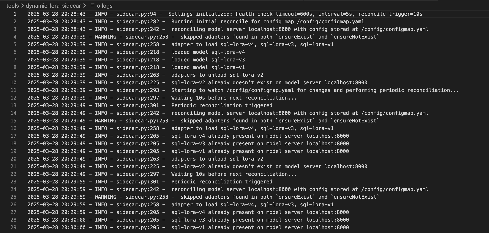

# Dynamic LORA Adapter Sidecar for vLLM

This is a sidecar-based tool to help rolling out new LoRA adapters to a set of running vLLM model servers. The user deploys the sidecar with a vLLM server, and using a ConfigMap, the user can express their intent as to which LoRA adapters they want to have the running vLLM servers to be configure with. The sidecar watches the ConfigMap and sends load/unload requests to the vLLM container to actuate on the user intent. 

## Overview

The sidecar continuously monitors a ConfigMap mounted as a YAML configuration file. This file defines the desired state of LORA adapters, including:

- **Adapter ID:** Unique identifier for the adapter.
- **Source:** Path to the adapter's source files.
- **Base Model:** The base model to which the adapter should be applied.
- **toRemove:** (Optional) Indicates whether the adapter should be unloaded.

The sidecar uses the vLLM server's API to load or unload adapters based on the configuration. It also periodically reconciles the registered adapters on the vLLM server with the desired state defined in the ConfigMap, ensuring consistency.

## Features

- **Dynamic Loading and Unloading:**  Load and unload LORA adapters without restarting the vLLM server.
- **Continuous Reconciliation:**  Ensures the vLLM server's state matches the desired configuration.
- **ConfigMap Integration:**  Leverages Kubernetes ConfigMaps for easy configuration management.
- **Easy Deployment:**  Provides a sample deployment YAML for quick setup.

## Repository Contents

- **`sidecar.py`:**  Python script for the sidecar container.
- **`Dockerfile`:**  Dockerfile to build the sidecar image.
- **`configmap.yaml`:**  Example ConfigMap YAML file.
- **`deployment.yaml`:**  Example Kubernetes deployment YAML.

## Usage


1. **Build the Docker Image:**
   ```bash
   docker build -t <your-image-name> .
   ```

2. **Create a configmap:**
   ```bash
   kubectl create configmap name-of-your-configmap --from-file=your-file.yaml
   ```

3. **Mount the configmap and configure sidecar in your pod**
   ```yaml
   volumeMounts: # DO NOT USE subPath
         - name: config-volume
           mountPath:  /config
   ```
   Do not use subPath, since configmap updates are not reflected in the file

## Command Line Arguments

The sidecar supports the following command-line arguments:

- `--health-check-timeout`: Maximum time in seconds to wait for the vLLM server health check (default: 300)
- `--health-check-interval`: Interval in seconds between health check attempts (default: 2)
- `--reconcile-trigger`: Time in seconds between forced reconciliation runs (default: 5)
- `--config`: Path to the config map file (default: value from DYNAMIC_LORA_ROLLOUT_CONFIG env var or "/config/configmap.yaml")
- `--config-validation`: Enable config validation (default: True)

## Configuration Fields
- `vLLMLoRAConfig`[**required**]  base key 
- `host` [*optional*] Model server's host. defaults to localhost
- `port` [*optional*] Model server's port. defaults to 8000
- `name` [*optional*] Name of this config
- `defaultBaseModel` [*optional*] Default base model to use for all adapters when not specified individually
- `ensureExist` [*optional*] List of models to ensure existence on specified model server.
    -  `models` [**required**] [list]
        - `id` [**required**] unique id of lora adapter
        - `source` [**required**] path (remote or local) to lora adapter
        - `base-model` [*optional*] Base model for lora adapter (overrides defaultBaseModel)
- `ensureNotExist` [*optional*]
    - `models` [**required**] [list]
        - `id` [**required**] unique id of lora adapter
        - `source` [**required**] path (remote or local) to lora adapter
        - `base-model` [*optional*] Base model for lora adapter (overrides defaultBaseModel)

## Example Configuration

Here's an example of using the `defaultBaseModel` field to avoid repetition in your configuration:

```yaml
apiVersion: v1
kind: ConfigMap
metadata:
  name: vllm-llama2-7b-adapters
data:
  configmap.yaml: |
      vLLMLoRAConfig:
        name: vllm-llama2-7b
        port: 8000
        defaultBaseModel: meta-llama/Llama-2-7b-hf
        ensureExist:
          models:
          - id: tweet-summary-1
            source: vineetsharma/qlora-adapter-Llama-2-7b-hf-TweetSumm
          - id: tweet-summary-2
            source: mahimairaja/tweet-summarization-llama-2-finetuned  
```

In this example, both adapters will use `meta-llama/Llama-2-7b-hf` as their base model without needing to specify it for each adapter individually.

You can still override the default base model for specific adapters when needed:

```yaml
apiVersion: v1
kind: ConfigMap
metadata:
  name: vllm-mixed-adapters
data:
  configmap.yaml: |
      vLLMLoRAConfig:
        name: vllm-mixed
        port: 8000
        defaultBaseModel: meta-llama/Llama-2-7b-hf
        ensureExist:
          models:
          - id: tweet-summary-1
            source: vineetsharma/qlora-adapter-Llama-2-7b-hf-TweetSumm
          - id: code-assistant
            source: huggingface/code-assistant-lora
            base-model: meta-llama/Llama-2-13b-hf  # Override for this specific adapter
```
## Example Deployment

The [deployment.yaml](deployment.yaml) file shows an example of deploying the sidecar with custom parameters:

```yaml
apiVersion: apps/v1
kind: Deployment
metadata:
  name: dynamic-lora-reconciler
spec:
  replicas: 1
  selector:
    matchLabels:
      app: dynamic-lora-reconciler
  template:
    metadata:
      labels:
        app: dynamic-lora-reconciler
    spec:
      containers:
      - name: reconciler
        image: your-image:tag
        command: ["python", "sidecar.py", "--health-check-timeout", "600", "--health-check-interval", "5", "--reconcile-trigger", "10"] #optional if overriding default values
        volumeMounts:
        - name: config-volume
          mountPath: /config
      volumes:
      - name: config-volume
        configMap:
          name: name-of-your-configmap
```

Note: This uses [sidecar](https://kubernetes.io/docs/concepts/workloads/pods/sidecar-containers/)(`initContainer` with `restartPolicy` set to `always`) which is beta feature enabled by default since k8s version 1.29. They need to be enabled in 1.28 and prior to 1.28 sidecar are not officially supported.

## Screenshots & Testing
The sidecar was tested with the Deployment and ConfigMap specified in this repo. Here are screen grabs of the logs from the sidecar and vllm server. One can verify that the adapters were loaded by querying `v1/models` and looking at vllm logs.


